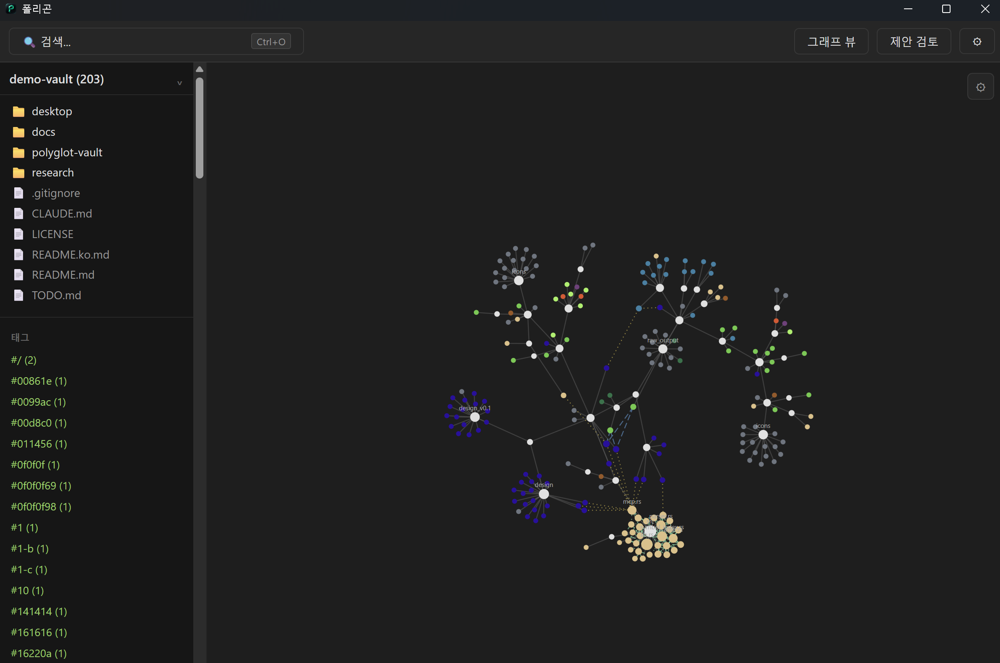

**한국어** | [English](README.md)

# Polyglot Local Vault

**빠른 로컬 우선 파일 검색·지식 Vault.**

내 컴퓨터의 파일뿐 아니라 함수, 심볼, 제목, 설정 키와 파일 간 관계까지 한 번에 검색하고 탐색하는 로컬 데스크톱 도구입니다. 인덱싱과 구조 추출은 결정론적 알고리즘으로 처리하며, AI는 MCP를 통해 선택적으로 연결합니다.

[](https://www.rust-lang.org/)
[](https://tauri.app/)
[](https://github.com/knox9014/polyglot-local-vault)
[](https://modelcontextprotocol.io/)
[](LICENSE)

**[소개 페이지](https://knox9014.github.io/polyglot-local-vault/)** · **[v0.1.0 다운로드](https://github.com/knox9014/polyglot-local-vault/releases/tag/v0.1.0)** · **[MCP 바이너리](https://github.com/knox9014/polyglot-local-vault/releases/download/v0.1.0/vault-mcp-windows-x64.exe)**



## 왜 Polyglot인가?

- **파일명보다 더 깊게 검색합니다.** 함수, 메서드, 제목, 설정 키 같은 내부 구조에도 안정적인 `vault://` 주소를 부여하고 직접 검색할 수 있습니다.
- **기본이 로컬·결정론적입니다.** 계정, 클라우드 서비스, AI 모델 없이도 인덱싱·검색·구조 추출·관계 추론이 로컬에서 동작합니다.
- **사람과 도구가 같은 Vault를 사용합니다.** 데스크톱 앱으로 직접 쓰거나 MCP의 `search`, `read`, `neighbors`, `link`로 외부 도구에 연결할 수 있습니다.

## 추측이 아닌 실측

| 지표 | 결과 |
|---|---:|
| 파일명 퍼지 검색 | **7.4 ms p95 @ 100K 파일** |
| Cold 인덱싱 | **18.5 s @ 100K 파일** |
| 지원 형식 | **12종** |
| 파일 링크 자동 복구율 | **95.7%** |
| 편집 중 심볼 보존율 | **Tree-sitter 96.9%** |
| MCP 평가 | **20/20 정답 · 질의당 평균 1.05회 호출** |
| grep 대비 MCP 토큰 사용량 | **17.6배 절감** |

> 수치는 실제 공개 저장소 18개, 약 23만 파일과 13만 커밋을 대상으로 측정했습니다. 측정 방법과 한계는 [`docs/design/17_MEASUREMENT_BASIS.md`](docs/design/17_MEASUREMENT_BASIS.md)에 기록되어 있습니다.

**현재 상태:** 결정론적 인덱싱·검색, 12개 형식 심볼 추출, 관계 그래프·제안 시스템, MCP 연동까지 P0–P4 완료.

## 진행 상황

| Phase | 내용 | 상태 |
|---|---|---|
| P0 | 스캔 · `vault://` 주소 · 락 · 정합성 스캔 · watcher · git reader · Parser Adapter | 완료 (2026-08-18) |
| P1 | Fast Search — path table · 역인덱스 · 증분 인덱싱 · 검색창 + 뷰어 | 완료 (2026-08-19) |
| P2 | Parsers + Symbol Search — 12개 형식에서 심볼 추출 | 완료 (2026-08-19) |
| P3 | Workspace + Graph + Suggestions — R1 · R2 · import 해석, 승인 UI, D3 그래프 | 완료 (2026-08-21) |
| P4 | MCP — `search` / `read` / `neighbors` / `link` 4툴 stdio 서버 | 완료 (2026-08-21) |

데스크톱 프레임워크는 **Tauri로 확정**됐다 (2026-08-18, Windows release 빌드 keystroke p95 8.4ms vs PySide6 14.7ms).

다음은 미정 — 후보는 실사용 버그 수정, 승인율 게이트(P3 종료 조건) 측정, 배포 준비.

## 시작하기

Claude Code에서 이 디렉터리를 열면 `CLAUDE.md` 를 먼저 읽는다.
사람이 읽을 순서는 다음과 같다.

1. `CLAUDE.md` — 현재 상태, 확정 결정, 기각된 설계, 다음 할 일 (**정본**)
2. `docs/design/00_README.md` — 설계 문서 패키지 개요
3. `docs/design/18_DATA_FORMATS.md` — `vault://` 주소 문법과 `.vault/` 파일 형식
4. `docs/design/17_MEASUREMENT_BASIS.md` — 모든 수치의 출처와 한계

`TODO.md` 의 blocker 7 · major 7 · minor 3 은 **전부 닫혔다** (2026-08-17). 이력으로만 남아 있다.

### 빌드

```bash
cd polyglot-vault && cargo test     # 코어 테스트
cd desktop && npm install
npm run tauri dev                   # 데스크톱 앱 개발 실행
npm run tauri build                 # 릴리스 빌드
```

MCP 서버는 데스크톱 앱과 별개인 stdio 바이너리다. 직접 빌드하거나:

```bash
cd polyglot-vault && cargo run --bin vault-mcp
```

**[미리 빌드된 Windows 바이너리 다운로드](https://github.com/knox9014/polyglot-local-vault/releases/download/v0.1.0/vault-mcp-windows-x64.exe)** 후 MCP 클라이언트(Claude Desktop, Claude Code, Codex 등)에 경로를 등록해도 된다:

```json
{
  "mcpServers": {
    "polyglot-vault": {
      "command": "C:\\path\\to\\vault-mcp-windows-x64.exe",
      "args": ["C:\\path\\to\\your\\vault"]
    }
  }
}
```

`search`·`read`·`neighbors`·`link` 네 개 툴을 제공한다.

## 구조

```
polyglot-vault/     Rust 코어 — 인덱스 · 파서 · 제안 엔진 · MCP (src/mcp.rs, src/bin/vault-mcp.rs)
desktop/            Tauri 데스크톱 앱 (src-tauri/ Rust, src/ 프런트)
docs/design/        v0.2 설계 문서 19개
docs/design_v0.1/   원본 v0.1 (참고용, 수정 금지)
research/reports/   설계 리뷰 + 벤치마크 보고서 + P4 MCP 호출 효율 실측
research/data/      측정 원시 데이터
research/bench/     재현 가능한 측정 코드 (Rust 4 / Python 10)
```

## 지원 형식 12종

코드 `.py` `.go` `.rs` `.ts` (Tree-sitter로 class/struct/trait/interface/function/method) ·
문서 `.md` `.rst` `.txt` (heading) ·
데이터 `.json` `.yaml` `.toml` (중첩 키 → JSON Pointer) `.csv` (헤더 컬럼) ·
노트북 `.ipynb` (코드 셀을 Python 파서로 재분석)

## 핵심 실측값

전부 실제 공개 저장소 18개(커밋 13만, 파일 23만)에서 측정했다. 합성 데이터 없음.
조건은 `docs/design/17_MEASUREMENT_BASIS.md` 참조.

| 지표 | 값 |
|---|---|
| 파일명 퍼지 검색 p95 | 7.4 ms @ 100K 파일 (2코어) |
| cold 인덱싱 | 18.5 s @ 100K 파일 |
| 전문 인덱스 / 원본 | 5.5 % |
| 정합성 스캔 | 281 ms @ 100K 파일 |
| 파일 링크 자동 복구율 | 95.7 % |
| 심볼 링크 복구율 | 자동 80.0 % → 1클릭 포함 93.6 % |
| 편집 중 심볼 보존 | Tree-sitter 96.9 % vs CPython ast 16.7 % |
| MCP 호출 효율 (자연어 질의 20건) | 평균 1.05회, 정답 20/20, grep 대비 토큰 17.6배 절감 |

CI 게이트는 자동 복구율 기준이다 — 합산 심볼 > 78%, 파일 > 93%, 저장소별 심볼 > 63%, 파일 > 47%.
1클릭 포함 수치는 제품 목표이지 게이트가 아니다.

## 라이선스

[PolyForm Noncommercial 1.0.0](LICENSE) — 비영리 목적이면 누구나 자유롭게 쓰고 고치고 재배포할 수 있다.
상업적 이용(판매, 유료 서비스 제공, 수익을 위한 재배포)은 저작권자의 허락이 필요하다 — knox9014@gmail.com 으로 문의.
